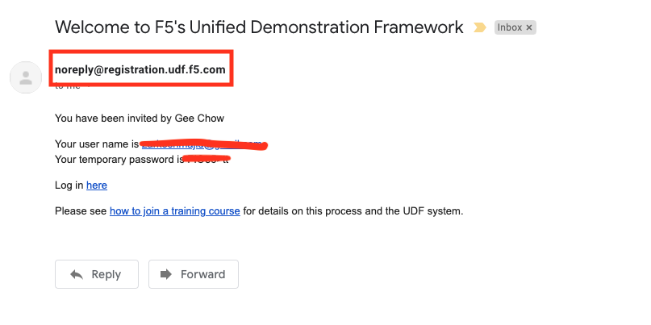
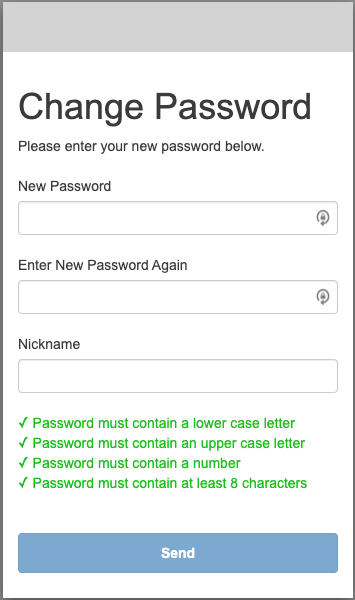
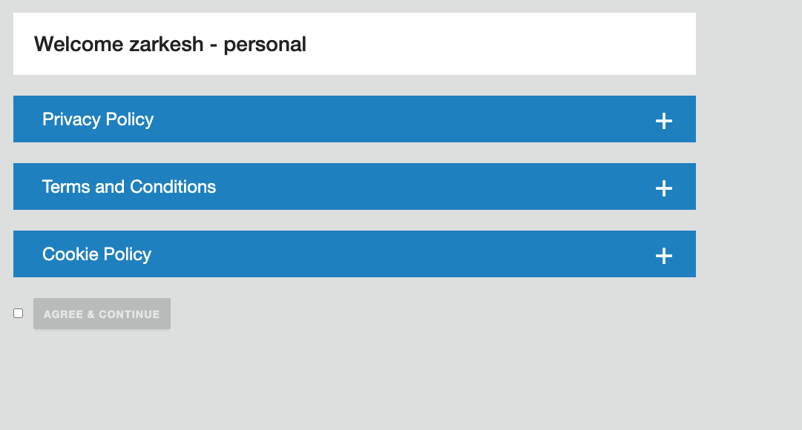
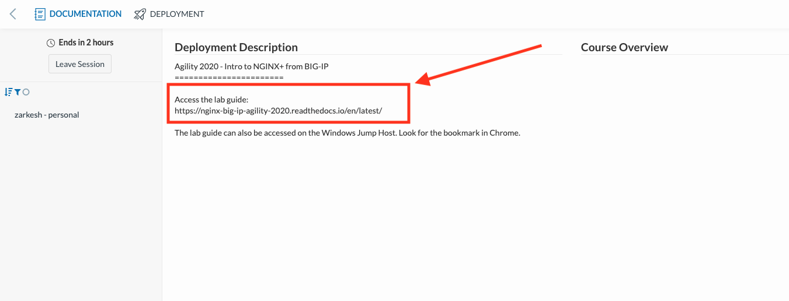

Let's Get Started - Join the UDF Course
=======================================

This lab will go through initial setup and add you the AppWorld 2024 class.  

Follow these steps to complete this lab:

**Exercise 1 - Setting Up Lab Workstation**

1. Open your web browser.
2. Navigate to https://udf.f5.com/courses
3. Login using your UDF credentials, you should have received an email from: noreply@registration.udf.f5.com

  
4. Upon first login, you will be prompted to change your password. 

5. Review and accept the terms for using UDF.

6. Locate the class "AppWorld 2024 - F5 NGINX Plus Access: Authentication for Web Access" and click launch. 

.. image:: ../images/ualaunch.png

7. You will be given an overview of the Course, press join.

.. image:: ../images/5join.png

8. The link for the lab guide  can be found in the description box: (https://clouddocs.f5.com/training/community/nginx/html/class9/class9.html)

9. Click on the 'deployment' tab in the top left, notice your lab environment is spinning up, once up everything will have green arrow icon. 

.. image:: ../images/7spinning.png

**Exercise 2 - Open Web Shell to the Nginx Server and open Firefox browser**

In this exercise, we will connect to the first NGINX Plus Server.   

10. Under the 'Systems' column, locate the 'NGINX 1' block. 
    
11. Click 'Access' -> 'Webshell' and this will open a new tab on your local browser. 

.. image:: ../images/9webshell.png
  :width: 800

Now we will open the firefox browser.

12. Under the 'Systems' column, locate the 'infra' block. 
    
13. Click 'Access' -> 'Firefox' and this will open a new tab on your local browser. 

.. image:: ../images/firefox_grab.png
  :width: 800