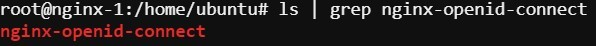

Installing Prerequisites:
=========================

This exercise will cover installing the Nginx JavaScript Module (njs) which is required for handling the interaction between NGINX Plus and the OpenID Connect identity provider (IdP). 

Install NGINX Plus njs module
~~~~~~~~~~~~~~~~~~~~~~~~~~~~~

1. Copy and paste below command into the NGINX 1 webshell (Use Ctrl/Shift+V to paste).

   .. code:: shell

      sudo apt install nginx-plus-module-njs

   **screenshot of expected output**

   .. image:: ../images/ualab03.png
      :align: left

2. Verify that the modules are loaded into NGINX Plus with the below command (Use Ctrl/Shift+V to paste again).  

   .. code:: shell
       
      sudo ls /etc/nginx/modules

   .. note:: You can also use Ctrl/Shift+C to copy from the Webshell. 

   **screenshot of expected output**

   .. image:: ../images/ualab04.png
     :align: left
     :width: 800

4. Now you will need to load the module into nginx.conf. 

The following directive needs to be included in the top-level (“main”) configuration context in /etc/nginx/nginx.conf, to load the NGINX JavaScript module:

**Copy and run below command on the NGINX 1 server to open the nano editor and select the main nginx configuration file**

.. code:: shell
    
   nano /etc/nginx/nginx.conf

**Below is the line of code that needs to be copied into /etc/nginx/nginx.conf file**

.. code:: shell
      
   load_module modules/ngx_http_js_module.so;

**screenshot of where to place line of code**

.. image:: ../images/ualab05.png

.. note:: 
   To quit nano, use the Ctrl+X key combination. If the file you are working on has been modified since the last time you saved it, you will be prompted to save the file first. Type 'y' to save the file then press enter to confirm.

**Save and exit the file**

4. Verify nginx config is good and reload
     
**verify configuration is good**
     
.. code:: shell

   nginx -t

**reload the nginx config**

.. code:: shell
      
   nginx -s reload

Create a clone of the nginx-openid-connect GitHub repository
~~~~~~~~~~~~~~~~~~~~~~~~~~~~~~~~~~~~~~~~~~~~~~~~~~~~~~~~~~~~

1. Clone the branch in your home directory with the command below.

.. code:: shell
        
   cd /home/ubuntu && git clone https://github.com/nginxinc/nginx-openid-connect.git

2. Verify the clone has completed by running the following command.  

.. code:: shell

   ls | grep nginx-openid-connect
		
**screenshot of output**
	

.. attention::
   
   **Please do not close the UDF Shell browser tab!**	

Configuring the IdP Keycloak:
=============================
   
.. note:: 
   These next steps will guide you through creating a keycloak client for NGINX Plus in the Keycloak GUI.

1. Open your browser tab with the Firefox container from the 'Getting Started' lab section.

2. Login to keycloak

url:
http://idp.f5lab.com:8080

3. Click on Administration Console

.. image:: ../images/keycloak_admin_page.png

4. Now enter credentials provided and sign in (if prompted, don't save the password)

.. note:: 
	Username: admin
	
	Password: admin

.. image:: ../images/ualab07.png
   
Create a Keycloak client for NGINX Plus in the Keycloak GUI:
~~~~~~~~~~~~~~~~~~~~~~~~~~~~~~~~~~~~~~~~~~~~~~~~~~~~~~~~~~~~
1. In the left navigation column, click Clients. 

.. image:: ../images/keycloak_click_clients.png
		
2. On the Clients page that opens, click the Create button in the upper right corner.
		
.. image:: ../images/keycloak_click_create.png
				
3. On the Add Client page that opens enter the below values then click the 'Save' button.

**Client ID – appworld2024**

**Client Protocol – openid-connect.**

.. image:: ../images/ualab08.png

4. On the appworld2024 clients page that opens, enter or select these values on the Settings tab, then scroll down and click 'Save' (note that there is an underscore before 'codexch' in the path):

.. attention::
   You will need to type in the URI below, as it's not possible to paste into the Firefox conatiner.

Client ID - appworld2024
		
Access Type – confidential

Valid Redirect URIs - http://nginxdemo.f5lab.com:8010/_codexch

.. image:: ../images/ualab09.png

.. note::
	For production, we strongly recommend that you use **SSL/TLS (port 443)**. The port number is **mandatory** even when you’re using the default port for HTTP (80) or HTTPS (443). 
	Valid Redirect URIs – This is the URI of the NGINX Plus origin web server instance, including the port number, and ending in /_codexch

5. Click the Credentials tab and copy the value in the 'Secret' field to the Firefox 'Clipboard', then make a note of it on your local machine by opening the Clipboard and copying the value. You will need this for the NGINX Plus configuration later.

.. image:: ../images/client_secret.png
	
6. While still under the appworld2024 Clients Page Click the Roles tab, then click the Add Role button in the upper right corner of the page that 
opens.

.. image:: ../images/keycloak_click_role.png
	
7. On the Add Role page that opens, type a value in the Role Name field (here it is: nginx-keycloak-role) and click the 'Save' button.

.. image:: ../images/keycloak_save_role.png
	
Creating a user in keycloak
~~~~~~~~~~~~~~~~~~~~~~~~~~~

1. In the left navigation column, click Users. On the Users page that opens, then click the 'Add User' button in the upper right corner to create a new user with the Username "user01" (no quotes), then click 'Save'.

.. image:: ../images/keycloak_add_user.png
	
2. Once create user is completed, now click on the Credentials Tab at the top of the screen. 

3. Enter the Password appworld2024 and Confirm.

4. Toggle Temporary to OFF, and clock 'Set Password' (click yes, you're sure).

.. image:: ../images/keycloak_cred.png
	
5. On the management page for the user (here, user01), click the 'Role Mappings' tab. On the page that opens, select appworld2024 on the 'Client 
Roles' drop‑down menu. Click 'nginx-keycloak-role' in the 'Available Roles' box, then click the 'Add selected' button below the box. The role then appears in the 'Assigned Roles' and 'Effective Roles' boxes, as shown in the screenshot.

.. image:: ../images/keycloak_role_mappings.png

Configure NGINX Plus as the OpenID Connect relying party
========================================================

1. Now go back to the NGINX 1 UDF Shell browser tab that you have open. You are going to run a configuration script.

Please copy and paste the below command into the webshell  **DON'T FORGET TO REPLACE THE CLIENT SECRET FOR THE CODE BELOW** (use the Client Secret note that you made earlier to help build the command syntax).

.. code:: shell

	./nginx-openid-connect/configure.sh -h nginxdemo.f5lab.com -k request -i appworld2024 -s YOURCLIENTSECRET -x http://idp.f5lab.com:8080/auth/realms/master/.well-known/openid-configuration

**screenshot of output**

.. image:: ../images/nginx_config_script.png
	:width: 800

.. note:: Information on switches being used in script:

	 echo " -h | --host <server_name>           # Configure for specific host (server FQDN)"
    
	 echo " -k | --auth_jwt_key <file|request>  # Use auth_jwt_key_file (default) or auth_jwt_key_request"
    
	 echo " -i | --client_id <id>               # Client ID as obtained from OpenID Connect Provider"
	 
	 echo " -s | --client_secret <secret>       # Client secret as obtained from OpenID Connect Provider"
    
	 echo " -p | --pkce_enable                  # Enable PKCE for this client"
    
	 echo " -x | --insecure                     # Do not verify IdP's SSL certificate"

2. Change Directory.

.. code:: shell
	
	cd ./nginx-openid-connect/

3. Now that you are in the nginx-openid-connect directory, use the provided command to copy the below files.

frontend.conf  openid_connect.js  openid_connect.server_conf  openid_connect_configuration.conf

.. code:: shell

	cp frontend.conf openid_connect.js openid_connect.server_conf openid_connect_configuration.conf /etc/nginx/conf.d/

4. After copying files change directory to '/etc/nginx/conf.d/'.

.. code:: shell 

	cd /etc/nginx/conf.d/

5. Using Nano edit the frontend.conf file

.. code:: shell

	nano frontend.conf

6. Update the server to 10.1.1.4:8081

.. image:: ../images/frontend_conf.png
	
**save file and close**

7. Using Nano edit the 'openid_connect.server_conf' file.

.. code:: shell

	nano openid_connect.server_conf

8. Update the resolver to use local host file as shown below. 

.. image:: ../images/host_lookup.png

**save and close file**

.. note:: 

	We are using the host file because this is a lab, so make sure to put in the LDNS server for the resolver.

9. Using Nano edit the openid_connect_configuration.conf.

.. code:: shell

	nano openid_connect_configuration.conf

10. Scroll down and modify the $oidc_client_secret from 0 to "yourclientsecret" from the earlier step, to look like the example below.  **Do not forget to add the quotation marks!**

.. image:: ../images/save_secret.png

**save and close file**

11. Reload Nginx.

.. code:: shell

	nginx -s reload

Testing the config
==================

Now that everything is done lets test the config!  Please go back to the Firefox tab on your local browser.

1. Clear recent history and cookies from the browser (under Privacy & Security on the Firefox Settings tab).

.. image:: ../images/clear_cookies.png

2. While still in Firefox, open a new tab and put http://nginxdemo.f5lab.com:8010 into the browser url field and launch the page.

.. image:: ../images/test_oidc.png

Notice you'll be redirected to the IdP for login. 

3. Once on the IdP page put in the credentials for the user you created. user01 with password appworld2024 (do not save the credentials, if prompted)

.. image:: ../images/auth_login.png

You should now see the webservice! You've been logged in and the browser has been issued a JWT Token establishing identity!  You can view the token by clicking 'More tools' and 'Web Developer Tools' in the Firefox menu, then selecting the 'Storage' tab and highlighting "auth_token".

.. image:: ../images/verificaion_webservice.png

Manage NGINX Plus with Instance Manager
=======================================

The OIDC authentication is working correctly. Now we will manage our NGINX Plus deployment with Instance Manager.

1. Open a new tab in Firefox and put https://nim.f5lab.com into the browser url field and launch the page (accept the risk and continue).

.. image:: ../images/nms_login.png

2. Sign into Instance Manager as admin. The username/password are saved in the browser so the fields should autopopulate.

.. image:: ../images/nms_admin_login.png

3. Once you are signed in, click on the instance manager module.

.. image:: ../images/nms_modules.png

4. Once directed to main console page of NGINX Instance Manager, click on 'Instances' and you will see the instructions on how to add NGINX instances to Instance Manager.

.. image:: ../images/instance_manager_main.png

5. Copy and run the below command on the NGINX 1 server to install the agent.

.. code:: shell

	curl -k https://nim.f5lab.com/install/nginx-agent | sudo sh

6. Once the installation is complete, start the nginx agent.

.. code:: shell

	sudo systemctl start nginx-agent

7. Now let's revisit the instance manager console and refresh the page. We should see the instance under the 'Instances' tab. 

.. image:: ../images/instance_manager_instances.png

8. Clicking on the instance will show installation details and metrics (these may take a few minutes to correlate).

.. image:: ../images/instance_manager_details.png  

Create the Nginx Plus Cluster in Instance Manager
~~~~~~~~~~~~~~~~~~~~~~~~~~~~~~~~~~~~~~~~~~~~~~~~~~~

1. To begin, we need to install the same agent on the new NGINX servers. First open a webshell connection to NGINX 2 and then do the same for NGINX 3. 

Copy and run the below command on -both- the NGINX 2 and NGINX 3 servers to install the agent.

.. code:: shell
	
   curl -k https://nim.f5lab.com/install/nginx-agent | sudo sh

2. Once the installation is complete, start the nginx agent on -both- servers.

.. code:: shell
	
   sudo systemctl start nginx-agent

.. note:: 

	Please leave all of the NGINX server webshell connections open!

3. Go back to the Instances Overview in Instance Manager and you should see the new servers.

.. image:: ../images/add_instance-7.jpg

4. Now we'll go back to -all three- NGINX server's webshell connections and create the Instance Group (if the webshell is currently closed for NGINX 1, please reopen it).
   To create the Instance Group, we need to edit the agent-dynamic.conf file and add an instance_group following the steps below for each of the three NGINX servers.

Open the file for editing in nano:

.. code:: shell
	
   nano /var/lib/nginx-agent/agent-dynamic.conf

.. image:: ../images/instance-group-1.jpg

...add the following to the bottom of the file and Save (Ctrl-X):

.. code:: shell

   instance_group: default

**screenshot of output**

.. image:: ../images/instance-group-2.jpg

...and then restart the agent.

.. code:: shell
	
   sudo systemctl restart nginx-agent

.. image:: ../images/instance-group-3.jpg

You should now see the Instance Group named 'default' in the Instance Manager.  We will need to 'Stage' the configuration that we created on NGINX 1 and sync it to NGINX 2 and 3.

   .. image:: ../images/instance-group-4.jpg

5. Go back to Instances tab and select 'nginx-1', then click 'Edit config'.

   .. image:: ../images/edit-config-nginx-1.jpg
   
6. Here you will select 'Save as' (the floppy disk icon).

   .. image:: ../images/stage-1.jpg

Name the staged configuration 'default-oidc' and click 'Save'.  

   .. image:: ../images/stage-2.jpg

7. In the 'Staged Configs', select 'default-oidc', then click 'Publish to'.

   .. image:: ../images/stage-3.jpg

   .. image:: ../images/stage-4.jpg

8. Drop down the list and select 'default' under 'Instance Groups' and click 'Publish'.

   .. image:: ../images/publish-1.jpg

   .. image:: ../images/publish-2.jpg

.. note:: 

	You may see an error message indicating that the publish completed, but is degraded.  Please disregard. If you go back into Instances and select, for example 'nginx-3', you'll see that the configuration was successfully synchronized.

   
9.  Now we will log on to the BIG-IP (admin:f5r0x!) to test and validate the configuration.  

   .. image:: ../images/big-ip-1.jpg
   .. image:: ../images/big-ip-2.jpg

10. Navigate to DNS > GSLB > Pools > Pool List and select 'gslbPool'.

   .. image:: ../images/big-ip-3.jpg
   .. image:: ../images/big-ip-3.5.jpg

11. Click the 'Statistics' tab and you'll see that only 'nginx1' is currently enabled and has 'Preferred' resolutions listed under 'Load Balancing'.

   .. image:: ../images/big-ip-4.jpg
   .. image:: ../images/big-ip-4.5.jpg

12. Navigate back to DNS > GSLB > Pools > Pool List, select 'gslbPool' and click the 'Members' tab.

   .. image:: ../images/big-ip-5.jpg

13. Here we will check the boxes next to 'nginx2' and 'nginx3' and click 'Enable' to add them to the load balancing pool.
    Refresh the page by clicking the 'Members' tab again and you will see the new members become active.
    Now click the 'Statistics' tab again and we are ready to test the configuation.

   .. image:: ../images/big-ip-6.jpg

14. Go back to Firefox, open a new tab, and navigate to http://nginxdemo.f5lab.com:8010 again.
    Log back in as user01 with password: appworld2024, as before.

   .. image:: ../images/test-gslb-1.jpg

15. Go back to the BIG-IP and refresh the page (Ctrl-F5) to verify that the successful login was performed by one of the other NGINX servers, in this case, nginx2.

   .. image:: ../images/test-gslb-2.jpg

16. Refresh the page in Firefox several times (Ctrl-R) and then refresh the BIG-IP Statistics again (Ctrl-F5) to confirm that the load balancing is leveraging each of the NGINX servers.

   .. image:: ../images/test-gslb-3.jpg
    

Congratulations, you have successfully completed the lab!

